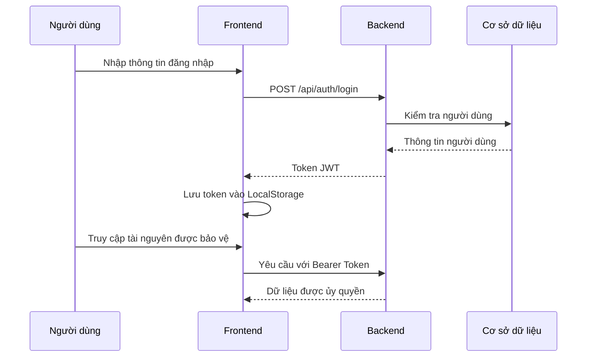
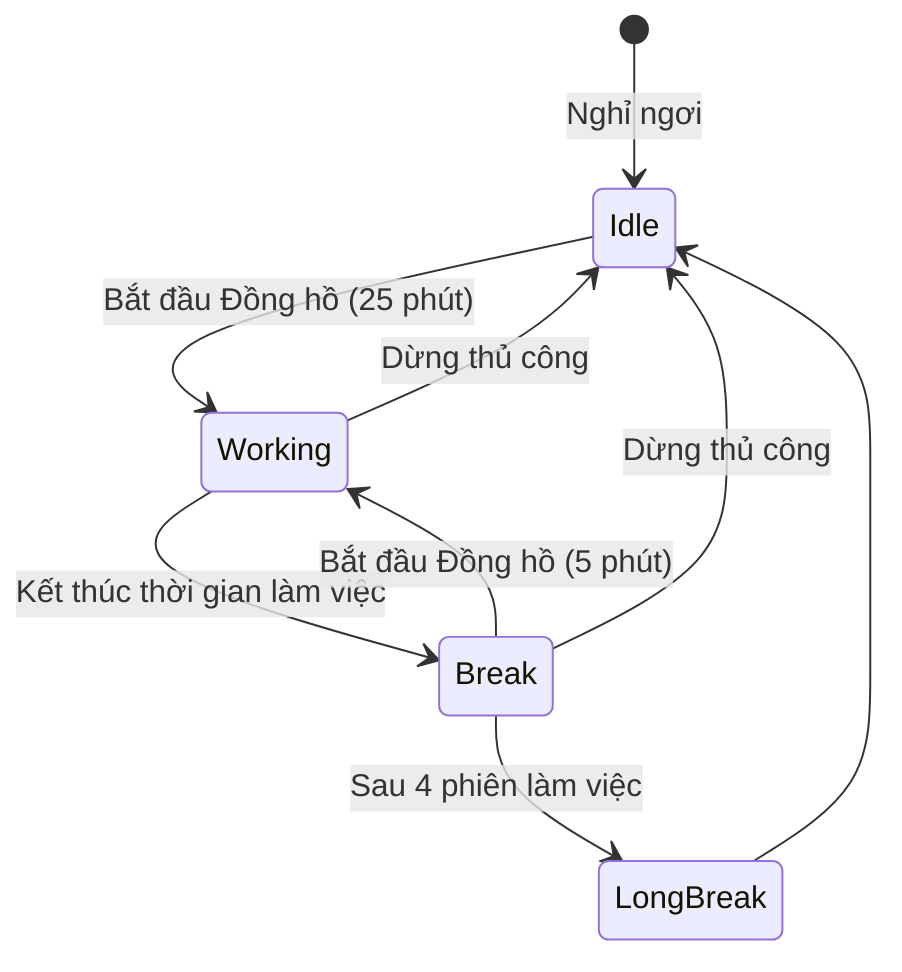
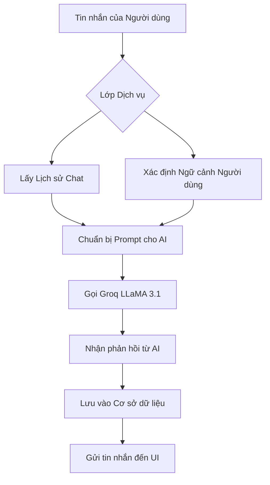

# Các Luồng Ứng dụng MyTask

Tài liệu này mô tả các luồng công việc chính của người dùng và logic kỹ thuật bên trong ứng dụng MyTask.

## 1. Luồng Xác thực (Authentication Flow)

Ứng dụng sử dụng JWT (JSON Web Tokens) để xác thực phi trạng thái (stateless authentication).

## 2. Quy trình Quản lý Công việc (Task Management Workflow)

Các công việc được tổ chức trong Không gian làm việc (Workspaces) và có thể được cập nhật qua nhiều trạng thái khác nhau.

- **Khởi tạo**: Người dùng tạo công việc trong một workspace cụ thể.
- **Sắp xếp**: Công việc có thể được lọc theo mức độ ưu tiên hoặc ngày đến hạn.
- **Hỗ trợ bởi AI**: Người dùng có thể yêu cầu chat AI gợi ý công việc hoặc chia nhỏ các mục tiêu phức tạp thành các nhiệm vụ nhỏ hơn.

## 3. Chu kỳ Tập trung & Pomodoro (Pomodoro & Focus Cycle)

Đồng hồ Pomodoro giúp người dùng duy trì sự tập trung sâu.

## 4. Logic Theo dõi Tài chính (Finance Tracking Logic)

Việc theo dõi tài chính cho phép người dùng giám sát các thói quen và chi tiêu của họ.

- **Nhập thủ công**: Người dùng ghi lại thu nhập hoặc chi phí.
- **Tổng hợp Dashboard**: Backend tổng hợp dữ liệu hàng tháng để hiển thị mô hình chi tiêu so với ngân sách.

## 5. Tương tác Chat AI (AI Chat Interaction)

Trợ lý AI sử dụng một hệ thống chat có nhận thức ngữ cảnh.

## 6. Chia nhỏ Mục tiêu & Cột mốc (Goal & Milestone Breakdown)

1. Người dùng thiết lập một **Mục tiêu** cấp cao.
2. Người dùng chia nhỏ Mục tiêu thành 3-5 **Cột mốc**.
3. Khi các Cột mốc hoàn thành, thanh tiến độ của Mục tiêu sẽ được cập nhật thời gian thực trên Dashboard.
