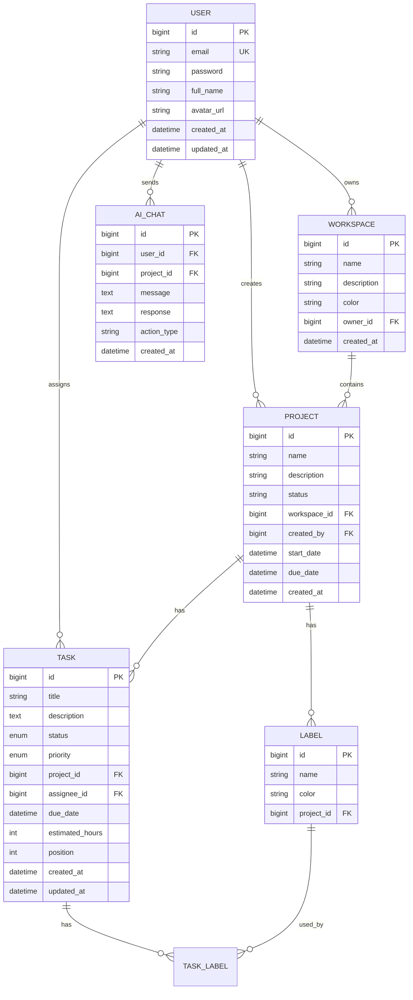

# MyTask - Ứng dụng Quản lý Cuộc sống Cá nhân với AI

## Tổng quan
Xây dựng ứng dụng web quản lý cuộc sống cá nhân với các tính năng như Jira/ClickUp, tích hợp AI thông qua Groq API để hỗ trợ người dùng quản lý công việc hiệu quả hơn.

### Tech Stack
- **Backend**: Spring Boot 3.2.x, Java 21, Spring Security, JWT
- **Frontend**: React 18 + Vite, Redux Toolkit, TailwindCSS
- **Database**: MySQL 8
- **AI**: Groq API (LLaMA 3.1/Mixtral models)
- **Language**: Tiếng Việt

---

## User Review Required

> [!NOTE]
> **Xác nhận**: Spring Boot 3.2.x, Groq API Key đã sẵn sàng, Deploy lên Render/Vercel/Aiven

---

## Proposed Changes

### Backend - Core Architecture

#### [MODIFY] [pom.xml](file:///d:/Java%20Study/Projects/MyTask/my-task-be/pom.xml)
Thêm dependencies:
- `spring-boot-starter-web` - REST API
- `spring-boot-starter-data-jpa` - Database ORM
- `spring-boot-starter-security` - Authentication
- `spring-boot-starter-validation` - Input validation
- `mysql-connector-j` - MySQL driver
- `jjwt-api/impl/jackson` - JWT authentication
- `lombok` - Reduce boilerplate
- `springdoc-openapi` - API documentation

---

#### [NEW] Database Schema



---

#### [NEW] Backend Package Structure

```
src/main/java/com/tamdao/mytask/
├── config/
│   ├── SecurityConfig.java
│   ├── JwtConfig.java
│   ├── CorsConfig.java
│   └── GroqConfig.java
├── controller/
│   ├── AuthController.java
│   ├── WorkspaceController.java
│   ├── ProjectController.java
│   ├── TaskController.java
│   └── AiChatController.java
├── service/
│   ├── AuthService.java
│   ├── WorkspaceService.java
│   ├── ProjectService.java
│   ├── TaskService.java
│   ├── AiService.java
│   └── GroqClient.java
├── repository/
│   ├── UserRepository.java
│   ├── WorkspaceRepository.java
│   ├── ProjectRepository.java
│   ├── TaskRepository.java
│   └── AiChatRepository.java
├── entity/
│   ├── User.java
│   ├── Workspace.java
│   ├── Project.java
│   ├── Task.java
│   ├── Label.java
│   └── AiChat.java
├── dto/
│   ├── request/
│   └── response/
├── security/
│   ├── JwtTokenProvider.java
│   ├── JwtAuthenticationFilter.java
│   └── CustomUserDetailsService.java
├── exception/
│   └── GlobalExceptionHandler.java
└── MyTaskApplication.java
```

---

### Frontend Structure

#### [NEW] React Project với Vite

```
my-task-fe/
├── public/
├── src/
│   ├── components/
│   │   ├── common/          # Button, Input, Modal, etc.
│   │   ├── layout/          # Sidebar, Header, Layout
│   │   ├── task/            # TaskCard, TaskModal, KanbanColumn
│   │   ├── project/         # ProjectCard, ProjectList
│   │   ├── workspace/       # WorkspaceSelector
│   │   └── ai/              # AiChatSidebar, AiMessage
│   ├── pages/
│   │   ├── auth/            # Login, Register
│   │   ├── dashboard/       # Dashboard overview
│   │   ├── workspace/       # Workspace views
│   │   ├── project/         # Project board/list
│   │   └── settings/        # User settings
│   ├── store/               # Redux slices
│   ├── services/            # API services
│   ├── hooks/               # Custom hooks
│   ├── utils/               # Helper functions
│   ├── assets/              # Images, icons
│   ├── App.jsx
│   └── main.jsx
├── index.html
├── package.json
├── tailwind.config.js
└── vite.config.js
```

---

### AI Integration với Groq

#### [NEW] [GroqClient.java](file:///d:/Java%20Study/Projects/MyTask/my-task-be/src/main/java/com/tamdao/mytask/service/GroqClient.java)
HTTP client để gọi Groq API với các models:
- `llama-3.1-70b-versatile` - Xử lý tasks phức tạp
- `mixtral-8x7b-32768` - Backup model

#### [NEW] [AiService.java](file:///d:/Java%20Study/Projects/MyTask/my-task-be/src/main/java/com/tamdao/mytask/service/AiService.java)
Core AI service với các actions:

| Action | Mô tả | Prompt Strategy |
|--------|-------|-----------------|
| `CREATE_TASK` | Tạo task từ mô tả tự nhiên | Parse intent → Extract title, description, priority, due date |
| `ANALYZE_PRIORITY` | Phân tích và đề xuất ưu tiên | Analyze workload → Suggest reordering |
| `GENERATE_REPORT` | Tạo báo cáo tổng hợp | Aggregate data → Generate markdown summary |
| `ANSWER_QUESTION` | Trả lời câu hỏi | Context-aware Q&A về project/tasks |

---

### UI/UX Design Highlights

```carousel
#### 🎨 Main Dashboard
- Overview statistics (tasks completed, in progress, overdue)
- Quick actions panel
- Recent activity feed
- AI suggestions widget

<!-- slide -->

#### 📋 Kanban Board
- Drag & drop columns (To Do, In Progress, Review, Done)
- Task cards với priority indicators
- Quick edit inline
- Filtering by labels, assignee

<!-- slide -->

#### 💬 AI Chat Sidebar
- Floating button ở góc phải
- Chat history
- Quick commands: `/tạo`, `/phân tích`, `/báo cáo`
- Typing indicator và loading states
```

---

## Verification Plan

### Phase 1 Verification
1. **Backend startup**: 
   ```bash
   cd my-task-be && mvnw spring-boot:run
   ```
   - Verify application starts without errors
   - Check `/actuator/health` endpoint

2. **Frontend startup**:
   ```bash
   cd my-task-fe && npm run dev
   ```
   - Verify Vite dev server starts
   - Check UI renders correctly

### Phase 2 Verification
1. **API Testing** với Swagger UI:
   - Access `http://localhost:8080/swagger-ui.html`
   - Test all CRUD endpoints

2. **Manual UI Testing**:
   - Register new user
   - Login và verify JWT token
   - Create workspace → project → task
   - Drag task between columns

### Phase 3 Verification (AI)
1. **AI Chat Testing**:
   - Gửi message: "Tạo task học Java trong 2 ngày"
   - Verify task được tạo với đúng thông tin
   - Test phân tích priority
   - Test tạo báo cáo

---

## Implementation Order

| Phase | Duration | Focus |
|-------|----------|-------|
| 1 | 2-3 ngày | Setup backend + frontend foundation |
| 2 | 5-7 ngày | Core features (Auth, CRUD operations, Kanban) |
| 3 | 3-4 ngày | AI integration với Groq |
| 4 | 2-3 ngày | Polish, additional features, testing |

**Tổng thời gian ước tính**: 12-17 ngày làm việc

---

## Personal Life Management Features

Ngoài Task Management như Jira/ClickUp, ứng dụng sẽ bổ sung các tính năng quản lý cuộc sống cá nhân:

### 🎯 Habit Tracker (Theo dõi Thói quen)
| Entity | Fields |
|--------|--------|
| `HABIT` | id, name, description, frequency (daily/weekly), icon, color, user_id |
| `HABIT_LOG` | id, habit_id, completed_at, note |

**Features**: Daily check-in, streak tracking, progress charts, AI đề xuất thói quen mới

---

### 💰 Finance Tracker (Quản lý Chi tiêu)
| Entity | Fields |
|--------|--------|
| `CATEGORY` | id, name, type (income/expense), icon, color, user_id |
| `TRANSACTION` | id, amount, description, category_id, date, user_id |
| `BUDGET` | id, category_id, amount, period (monthly), user_id |

**Features**: Income/Expense tracking, Budget alerts, Monthly reports, AI phân tích xu hướng chi tiêu

---

### 🏆 Goals (Mục tiêu)
| Entity | Fields |
|--------|--------|
| `GOAL` | id, title, description, target_date, progress, status, user_id |
| `MILESTONE` | id, goal_id, title, target_date, is_completed |

**Features**: Long-term goals với milestones, Progress visualization, AI đề xuất action items

---

### 📝 Notes (Ghi chú)
| Entity | Fields |
|--------|--------|
| `NOTE` | id, title, content (markdown), folder_id, is_pinned, user_id, created_at |
| `FOLDER` | id, name, parent_id, user_id |

**Features**: Rich text editor, Folder organization, Quick notes, AI tóm tắt nội dung dài

---

### ⏱️ Pomodoro Timer
| Entity | Fields |
|--------|--------|
| `POMODORO_SESSION` | id, task_id, duration, started_at, completed_at, user_id |
| `POMODORO_SETTINGS` | id, work_duration, break_duration, long_break_duration, user_id |

**Features**: Focus timer, Session history, Productivity stats, Link với Tasks

---

### 📅 Daily Schedule / Lịch trình
- Calendar view tích hợp tasks, habits, goals
- Daily/Weekly planner
- AI gợi ý lịch trình tối ưu

---

## Deployment Strategy

| Dịch vụ | Nền tảng | Mục đích |
|---------|----------|---------|
| Backend API | **Render** | Ứng dụng Spring Boot |
| Cơ sở dữ liệu | **Aiven** | MySQL Database managed |
| Frontend | **Vercel** | React static files với CDN |

### Environment Configuration
```properties
# Production (Aiven)
SPRING_DATASOURCE_URL=jdbc:mysql://${DB_HOST}:${DB_PORT}/${DB_NAME}?useSSL=true&requireSSL=true
GROQ_API_KEY=${GROQ_API_KEY}
JWT_SECRET=${JWT_SECRET}
CORS_ALLOWED_ORIGINS=https://mytask.vercel.app

# Frontend (Vercel)
VITE_API_URL=https://mytask-production.up.railway.app
```
